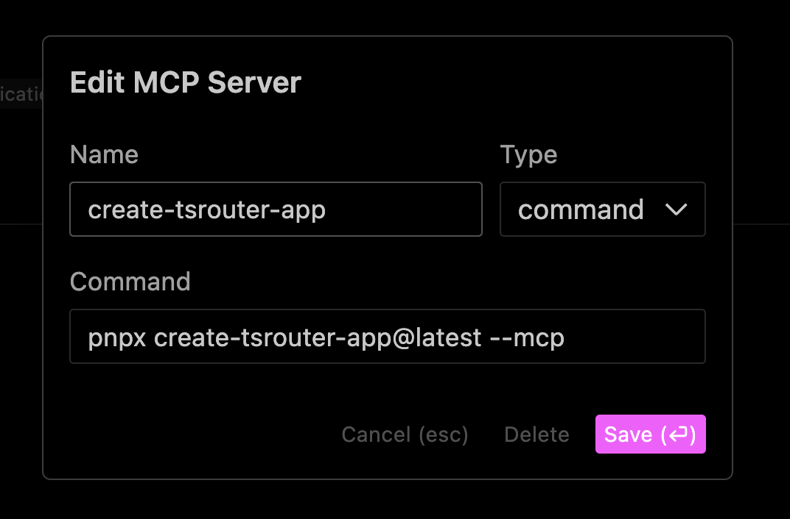

# Create React App for TanStack Router

This CLI applications builds Tanstack Router applications that are the functional equivalent of [Create React App](https://create-react-app.dev/).

To help accelerate the migration away from `create-react-app` we created the `create-tsrouter-app` CLI which is a plug-n-play replacement for CRA.

## Quick Start

To maintain compatability with `create-react-app` you can build a new application by running:

| Command                                                                          | Description                                       |
| -------------------------------------------------------------------------------- | ------------------------------------------------- |
| `npx create-tsrouter-app@latest my-app`                                          | Create a new app                                  |
| `npx create-tsrouter-app@latest my-app --template file-router`                   | Create a new file based app                       |
| `npx create-tsrouter-app@latest my-app --template typescript`                    | Create a new TypeScript app using the Code Router |
| `npx create-tsrouter-app@latest my-app --tailwind`                               | Add Tailwind CSS support                          |
| `npx create-tsrouter-app@latest my-app --framework solid`                        | Create a Solid app                                |
| `npx create-tsrouter-app@latest my-app --framework solid --template file-router` | Create a Solid app with file-router               |

If you don't specify a project name, the CLI will walk you through an interactive setup process:

```bash
npx create-tsrouter-app@latest
```

This will start an interactive CLI that guides you through the setup process, allowing you to choose:

- Project Name
- Router Type (File-based or Code-based routing)
- TypeScript support
- Tailwind CSS integration
- Package manager
- Git initialization

## Command Line Options

You can also use command line flags to specify your preferences directly:

```bash
npx create-tsrouter-app@latest my-app --template file-router --tailwind --package-manager pnpm
```

Available options:

- `--template <type>`: Choose between `file-router`, `typescript`, or `javascript`
- `--tailwind`: Enable Tailwind CSS
- `--package-manager`: Specify your preferred package manager (`npm`, `yarn`, `pnpm`, `bun`, or `deno`)
- `--no-git`: Do not initialize a git repository
- `--add-ons`: Enable add-on selection or specify add-ons to install

When using flags, the CLI will display which options were provided and only prompt for the remaining choices.

## Features

What you'll get is a Vite application that uses TanStack Router. All the files will still be in the same place as in CRA, but you'll get a fully functional Router setup under in `app/main.tsx`.

`create-tsrouter-app` is everything you loved about CRA but implemented with modern tools and best practices, on top of the popular TanStack set of libraries. Which includes [@tanstack/react-query](https://tanstack.com/query/latest) and [@tanstack/react-router](https://tanstack.com/router/latest).

## Routing Options

### File Based Routing (Recommended)

File Based Routing is the default option when using the interactive CLI. The location of the home page will be `app/routes/index.tsx`. This approach provides a more intuitive and maintainable way to structure your routes.

To explicitly choose File Based Routing, use:

```bash
npx create-tsrouter-app@latest my-app --template file-router
```

### Code Based Routing

If you prefer traditional code-based routing, you can select it in the interactive CLI or specify it by using either the `typescript` or `javascript` template:

```bash
npx create-tsrouter-app@latest my-app --template typescript
```

## Additional Configuration

### TypeScript

- File Based Routing always uses TypeScript
- For Code Based Routing, you can choose between TypeScript and JavaScript
- Enable TypeScript explicitly with `--template typescript`

### Tailwind CSS

Enable Tailwind CSS either through the interactive CLI or by adding the `--tailwind` flag. This will automatically configure [Tailwind V4](https://tailwindcss.com/).

### Package Manager

Choose your preferred package manager (`npm`, `bun`, `yarn`, `pnpm`, or `deno`) either through the interactive CLI or using the `--package-manager` flag.

Extensive documentation on using the TanStack Router, migrating to a File Base Routing approach, as well as integrating [@tanstack/react-query](https://tanstack.com/query/latest) and [@tanstack/store](https://tanstack.com/store/latest) can be found in the generated `README.md` for your project.

## Add-ons (experimental)

You can enable add-on selection:

```bash
npx create-tsrouter-app@latest --add-ons
```

This will prompt you to select the add-ons you want to enable during application creation.

You can enable specific add-ons directly by adding a comma separated list of add-on names to the `--add-ons` flag. For example:

```bash
npx create-tsrouter-app@latest my-app --add-ons shadcn,tanstack-query
```

You can get a list of all available add-ons by running:

```bash
npx create-tsrouter-app@latest --list-add-ons
```

This will display a list of all available add-ons for React that are compatible with the Code Router.

```bash
npx create-tsrouter-app@latest --list-add-ons --framework solid --template file-router
```

Will get you a list of all available add-ons for Solid that are compatible with the File Router.

## MCP (Model Context Protocol) Support (experimental)

You can launch the `create-tsrouter-app` CLI with the `--mcp` flag to enable MCP support. Use this in your MCP enabled IDE to allow the Agent model to generate TanStack Router applications.

```bash
npx create-tsrouter-app@latest --mcp
```

Shown below is the configuration for MCP support in Cursor.



# Contributing

Check out the [Contributing](CONTRIBUTING.md) guide.

# License

MIT
